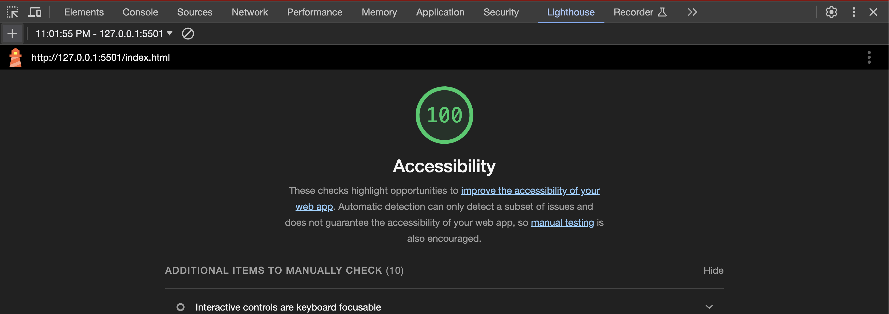

# LAB - Class 14

11.9.23

## Super-Odd-Ducks

The code creates an interactive voting system where users can click on their preferred product, and it tracks the number of clicks and displays the results once the session ends (after 25 clicks). The webpage should now be two pages with one page displaying the photos and the second page displaying the chart.

### Authors: Latherio Kidd and Stephanie G Johnson

### [Submission Link](https://github.com/StepheeGee/lab14-odd-duck.git)

### Lighthouse Accessibility Report Score

### Comments

How did this go, overall?

We worked tirelessly on this assignment, but finally got it in working order. Our storage is not producing any error codes. Our photos are displaying on the proper html file. We had difficulty assigning extensions the photos array that was provided in the app.js file. We created a function that would handle it, but kept getting error codes - 404 not found. What we realized was two things - if we target the sweep image, that is the only photo with the png extension, we could make an exception in the function for it. We also realized that because there was a default extension function given to us, in order to prevent the default from overriding all of the other images, we could assign a default image in the asset directory. Our greatest win was getting the chart to display in the chart.html file. 

What observations or questions do you have about what you’ve learned so far?

This was challenging. We really had questions about where to call the certain functions, for instance the Product.prototype.findvalidextension function. We had to resituate that function about ten times before we got it to work and be recognized in the browser as a function. And the issue was absolutely placement of that function. So understanding the order of events would be helpful.

How long did it take you to complete this assignment? And, before you started, how long did you think it would take you to complete this assignment?

We worked on this for two hours. And that was the required time frame to complete this assignment. 
